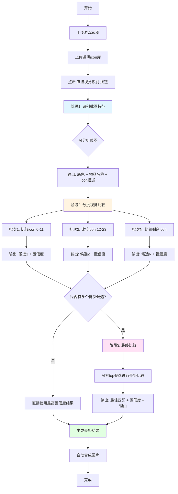

# 直接视觉识别流程说明

## 流程图示



---

## 阶段1: 识别截图特征

### 目标
分析游戏截图，识别icon的底色、物品名称和视觉特征

### 输入
- 游戏截图（1张）

### 提示词

```
你是一个游戏素材分析专家。请仔细观察这张游戏UI截图，识别其中的目标icon。

请严格按以下JSON格式输出（不要输出多余解释）：
{
  "icon_circle_background_color": "目标icon圆形底色，描述颜色（金/紫/蓝/绿/咖之一）",
  "item_name": "物品/角色的核心名称，例如'心纸【孙辅】'、'头像框【菌子不器】'等",
  "icon_description": "描述icon的视觉特征：形状、颜色、图案、是否为武器/道具/角色等"
}

注意：
1. icon_circle_background_color 必须是以下之一：金、紫、蓝、绿、咖
2. 只识别目标icon的圆形底色，不要与页面背景混淆
3. item_name 只包含物品名称本身，不包含描述文字
只输出JSON。
```

### 输出示例
```json
{
  "icon_circle_background_color": "紫",
  "item_name": "心纸【孙辅】",
  "icon_description": "人物头像，穿着古代服饰，紫色调为主"
}
```

---

## 阶段2: 分批视觉比较

### 目标
将截图和候选icon一起传给AI，让AI直接进行视觉比较（每批最多比较N个icon，默认12个）

### 输入
- 游戏截图（1张）
- 候选icon图片（12张，透明背景）

### 提示词

```
你是一个视觉比较专家。现在你会看到多张图片：

第1张图片：游戏截图，包含一个带彩色圆形底色的icon
第2张图片及之后：透明背景的候选icon，编号从 icon_0 到 icon_11

候选icon清单：
[
  { "id": "icon_0", "filename": "道具_武器_001.png", "index": 0 },
  { "id": "icon_1", "filename": "道具_装备_002.png", "index": 1 },
  ...
  { "id": "icon_11", "filename": "角色_头像_012.png", "index": 11 }
]

你的任务：
1. 仔细观察第1张截图中的icon图案（忽略圆形底色）
2. 逐一比较后续的透明背景候选icon
3. 找出与截图中icon图案最相似的那个候选icon

比较重点：
- 轮廓形状
- 主体图案
- 颜色分布
- 细节特征
- 整体结构

请输出严格JSON格式（不要输出Markdown代码块）：
{
  "best_match_index": 最佳匹配的索引数字（0到11）,
  "best_icon_filename": "最佳匹配的文件名",
  "confidence": 0.0到1.0之间的置信度,
  "reason": "为什么选择这个icon的理由，说明相似之处"
}
```

### 输出示例（批次1）
```json
{
  "best_match_index": 5,
  "best_icon_filename": "道具_角色_006.png",
  "confidence": 0.85,
  "reason": "该icon的人物面部轮廓、服饰颜色和整体构图与截图高度一致"
}
```

### 输出示例（批次2）
```json
{
  "best_match_index": 8,
  "best_icon_filename": "角色_孙辅_009.png",
  "confidence": 0.92,
  "reason": "人物特征完全匹配，包括发型、服装样式和面部表情"
}
```

### 批次处理说明
- 如果icon库有30个icon，每批12个，则分为3批
- 每批独立进行视觉比较
- 收集所有批次的候选结果

---

## 阶段3: 最终比较（仅当有多个批次候选时）

### 目标
从各批次筛选出的最优候选中，选出最终的最佳匹配

### 输入
- 游戏截图（1张）
- 各批次筛选出的top候选icon（最多5张）

### 提示词

```
你是一个视觉比较专家。这是最终选择阶段。

第1张图片：游戏截图
第2张图片及之后：从各批次筛选出的最优候选icon

候选清单（已按前期置信度排序）：
[
  {
    "id": "icon_0",
    "filename": "角色_孙辅_009.png",
    "index": 0,
    "previous_confidence": 0.92
  },
  {
    "id": "icon_1",
    "filename": "道具_角色_006.png",
    "index": 1,
    "previous_confidence": 0.85
  },
  {
    "id": "icon_2",
    "filename": "人物_武将_015.png",
    "index": 2,
    "previous_confidence": 0.78
  }
]

请从这些候选中选出与截图中icon最相似的那个。

输出JSON格式：
{
  "best_match_index": 最终选择的索引（0到2）,
  "confidence": 0.0到1.0,
  "reason": "最终选择理由"
}
```

### 输出示例
```json
{
  "best_match_index": 0,
  "confidence": 0.95,
  "reason": "icon_0的人物特征与截图完全一致，包括面部细节、服装纹理和整体色调，明显优于其他候选"
}
```

---

## 最终结果

### 输出信息
- **底色**: 紫
- **匹配icon**: 角色_孙辅_009.png（全局索引8）
- **道具名称**: 心纸【孙辅】
- **最终置信度**: 0.95
- **识别方式**: 直接视觉识别 ✓

### 自动操作
1. 设置选中的底色为"紫"
2. 设置选中的icon为"角色_孙辅_009.png"
3. 设置文件名为"心纸【孙辅】_紫.png"
4. 自动合成图片（底图+icon）
5. 用户可下载合成结果

---

## 与描述匹配识别的区别

| 对比项 | 描述匹配识别 | 直接视觉识别 |
|--------|-------------|-------------|
| **AI输入** | AI先看截图，生成文字描述<br>再用描述匹配候选icon（不看icon图片） | AI同时看到截图和候选icon图片<br>进行直接视觉比较 |
| **识别方式** | 间接：通过文字描述桥接 | 直接：图像对图像比较 |
| **准确性** | 依赖AI的描述能力 | 依赖AI的视觉比较能力 |
| **优势** | 对复杂场景的语义理解更好 | 对视觉细节的把握更精准 |
| **适用场景** | 截图特征明显<br>icon差异较大 | 候选icon相似度高<br>需要精细比较 |

---

## 参数配置

### 可调整参数
- **每批数量**: 1-20个icon（默认12）
  - 数量越少：API调用次数越多，但单次比较更精准
  - 数量越多：API调用次数越少，但单次比较压力更大

### API配置
- **端点**: OpenAI兼容的API端点
- **模型**: 支持视觉理解的模型（如GPT-4V、Claude-3等）
- **温度**: 0.1（保持一致性）
- **最大token**: 
  - 阶段1: 500
  - 阶段2: 800
  - 阶段3: 600

---

## 错误处理

### 可能的错误情况
1. **底色识别失败**: AI无法从截图中识别出有效的底色
2. **批次比较失败**: 某个批次无法返回有效的匹配索引
3. **所有批次失败**: 没有任何批次返回有效候选
4. **最终比较失败**: 最终阶段解析失败，回退到最高置信度结果

### 日志示例
```
========================================
[识别方式] 直接视觉识别
[说明] AI将同时看到参考图和候选icon图片，进行直接视觉比较
[开始] 使用直接视觉识别方法...
[信息] 截图已加载，icon库包含 30 个候选
[配置] 使用端点: https://api.openai.com/v1
[配置] 使用模型: gpt-4-vision-preview
[步骤1] AI识别截图: {...}
[步骤1] 识别结果 - 底色: 紫, 名称: 心纸【孙辅】
[批次 1/3] 比较 icon 0 到 11，共 12 个
[批次1] 候选: 道具_角色_006.png, 置信度: 0.85
[批次 2/3] 比较 icon 12 到 23，共 12 个
[批次2] 候选: 角色_孙辅_009.png, 置信度: 0.92
[批次 3/3] 比较 icon 24 到 29，共 6 个
[批次3] 候选: 人物_武将_015.png, 置信度: 0.78
[汇总] 共收集到 3 个候选结果
[最终比较] 从 3 个候选中选出前 3 个
[最终比较] AI响应: {...}
[成功] 直接视觉识别完成
[结果] 底色: 紫
[结果] 匹配icon: 角色_孙辅_009.png (索引8)
[结果] 道具名称: 心纸【孙辅】
[结果] 最终置信度: 0.95
[结果] 理由: icon_0的人物特征与截图完全一致...
[完成] 已自动应用匹配结果并合成图片
[识别方式] 直接视觉识别 ✓
```

---

## 性能考虑

### API调用次数
- **阶段1**: 1次（识别截图）
- **阶段2**: N次（N = ceil(icon总数 / 每批数量)）
- **阶段3**: 0-1次（仅当有多个批次候选时）

### 示例
- 30个icon，每批12个：1 + 3 + 1 = **5次API调用**
- 50个icon，每批12个：1 + 5 + 1 = **7次API调用**
- 12个icon，每批12个：1 + 1 + 0 = **2次API调用**

### 优化建议
1. 根据icon库大小调整每批数量
2. 预先筛选明显不相关的icon
3. 使用更快的模型进行初步筛选
4. 缓存识别结果避免重复计算

---

## 总结

直接视觉识别通过让AI同时看到参考图和候选图片，实现了更精准的视觉匹配。整个流程分为三个阶段：

1. **特征识别阶段**: 理解截图内容
2. **批次比较阶段**: 分批进行视觉比较
3. **最终选择阶段**: 从候选中选出最佳

这种方法特别适合需要精细比较的场景，能够更好地捕捉视觉细节。
